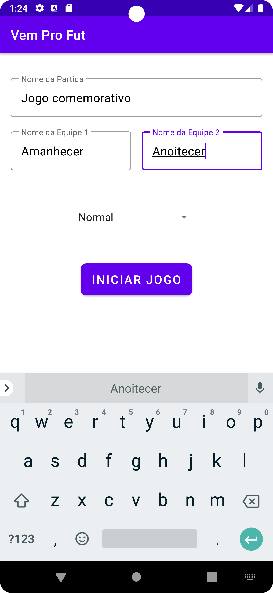
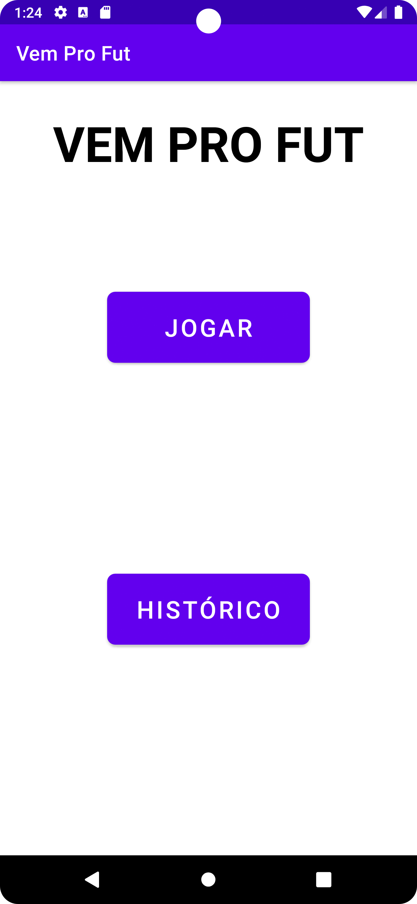
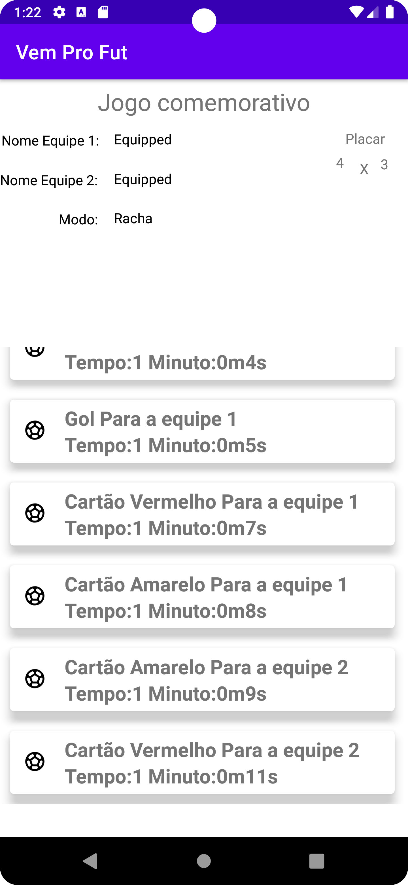
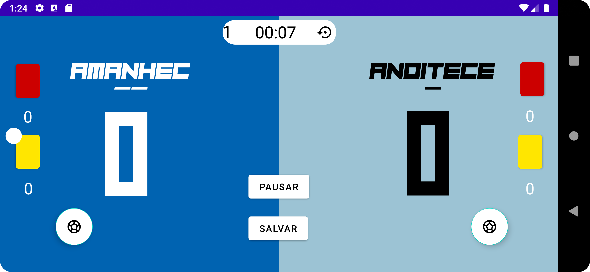

# Placar - Vem pro Fut

O Vem pro Fut é um aplicativo simples para acompanhar pontuações de jogos e partidas. Ele oferece uma interface intuitiva para inserir nomes de equipes e atualizar os placares de acordo com o andamento do jogo.

## Recursos Principais

- Inserir nomes das equipes participantes.
- Atualizar os placares das equipes durante o jogo.
- Contabilizar a quantidade de cartões para cada time.
- Salvar o resultado para consultas futuras durante ou após o fim do jogo.

## Capturas de Tela

.png)
.png)
.png)
.png)

## Como Usar

1. Faça o download e instale o aplicativo no seu dispositivo Android.
2. Abra o aplicativo Vem pro Fut.
3. Insira os nomes das equipes nos campos apropriados.
4. À medida que o jogo progride, utilize os botões de incremento/decremento (bolinhas do lado de cada time) para atualizar os placares das equipes.
5. Para gravar o resultado, utilize o botão "Gravar".

## Tecnologias Utilizadas

- Linguagem de programação: Java/Kotlin
- Ambiente de Desenvolvimento: Android Studio
